# Massive Parallel RAG Pipeline

**85x faster embedding** by running 1000+ chunks in parallel with Flow4AI.

This example demonstrates Flow4AI's core strength: **orchestrating thousands of concurrent tasks** while keeping code simple and readable.

## Why This Matters

| Approach | Time for 1000 Chunks | Code Complexity |
|----------|---------------------|-----------------|
| Sequential loop | ~6.5 minutes | Simple but slow |
| Manual async/threading | Fast but complex | Error-prone |
| **Flow4AI** | **~4.6 seconds** | Simple *and* fast |

## Flow4AI Patterns Demonstrated

### 1. Parallel Task Submission

```python
# Submit 1000+ embedding tasks - all run concurrently
workflow = job(embed=embed_chunk)
fm = FlowManager(on_complete=on_complete)
fq_name = fm.add_workflow(workflow, "embedding")

for chunk in chunks:
    fm.submit_task({"embed.text": chunk.text}, fq_name)

fm.wait_for_completion()  # All 1000 complete in ~4.6s
```

### 2. Sequential Workflow Chaining

```python
# Chain jobs with >> operator - each receives predecessor output
query_workflow = (
    job(embed_query=embed_query_job)
    >> job(vector_search=vector_search_job)
    >> job(bm25_rerank=bm25_rerank_job)
    >> job(generate_answer=generate_answer_job)
)
```

### 3. Accessing Predecessors' Data

```python
def bm25_rerank_job(j_ctx):
    # Immediate predecessors via j_ctx["inputs"]
    search_result = j_ctx["inputs"]["vector_search"]
    
    # Earlier jobs via j_ctx["saved_results"] (needs save_result=True)
    embed_data = j_ctx["saved_results"].get("embed_query", {})
```

## Quick Start

```bash
# Install dependencies
pip install chromadb rank-bm25

# Set API key
export OPENAI_API_KEY=your_key

# Run full pipeline (downloads corpus, embeds, queries)
python rag_pipeline.py

# Run specific modes
python rag_pipeline.py --mode index    # Index only
python rag_pipeline.py --mode query    # Query only
python rag_pipeline.py --chunks 100    # Limit for testing
```

## Architecture

```mermaid
graph LR
    subgraph "INDEXING (FlowManager Parallel)"
        A[📄 Documents] --> B[✂️ Chunker]
        B --> C{🔄 FlowManager}
        C --> D1[embed]
        C --> D2[embed]
        C --> D3["... (1000+)"]
        D1 --> E[💾 ChromaDB]
        D2 --> E
        D3 --> E
    end
```





```mermaid
graph LR
    subgraph "QUERY (FlowManager Sequential)"
        Q[❓ Query] --> |j_ctx.inputs| R[embed_query]
        R --> |j_ctx.inputs| S[vector_search]
        S --> |j_ctx.inputs| T[bm25_rerank]
        T --> |j_ctx.inputs| U[generate_answer]
    end
```

## Performance Results

### Indexing (1000 chunks)

| Metric | Value |
|--------|-------|
| Single embedding | ~0.3s |
| Sequential (theoretical) | ~388s (6.5 min) |
| **FlowManager Parallel** | **4.59s** |
| **Speedup** | **~85x** |

### Query (5 needle-in-haystack tests)

| Mode | Time | Speedup |
|------|------|---------|
| Sequential | 10.83s | 1x |
| **FlowManager** | **3.65s** | **~3x** |

## File Structure

```
parallel_rag/
├── rag_pipeline.py      # Main entry point (see FlowManager patterns)
├── jobs/
│   ├── embedding.py     # OpenAI embedding
│   ├── indexing.py      # ChromaDB operations
│   ├── search.py        # Vector search + BM25
│   ├── generation.py    # GPT-4o-mini answer generation
│   └── query_jobs.py    # Job functions with j_ctx pattern
└── utils/
    ├── chunking.py      # Text chunking
    ├── download.py      # Corpus download
    └── output.py        # Print helpers
```

## Technical Stack

| Component | Choice |
|-----------|--------|
| **Orchestration** | Flow4AI |
| **Vector DB** | ChromaDB |
| **Embedding** | OpenAI `text-embedding-3-small` |
| **LLM** | OpenAI `gpt-4o-mini` |
| **Reranking** | BM25 (`rank-bm25`) |
