# Massive Parallel RAG Pipeline

Demonstrates Flow4AI's parallel execution at scale with 1000+ document chunks.

## Flow4AI Workflow Architecture

```mermaid
graph LR
    subgraph "INDEXING PIPELINE (Flow4AI Orchestrated)"
        A[📄 Documents] --> B[✂️ Chunker]
        B --> C{🔄 FlowManager}
        C --> D1[embed_chunk]
        C --> D2[embed_chunk]
        C --> D3[embed_chunk]
        C --> D4["... (1000 parallel)"]
        D1 --> E[💾 ChromaDB]
        D2 --> E
        D3 --> E
        D4 --> E
    end
```

```mermaid
graph LR
    subgraph "QUERY PIPELINE (Async, not FlowManager)"
        Q[❓ Query] --> R[embed_chunk]
        R --> S[🔍 Vector Search]
        S --> T[📊 BM25 Rerank]
        T --> U[🤖 Generate Answer]
    end
```





**Flow4AI Usage:** Only the embedding step uses FlowManager for massive parallelism. The query pipeline uses direct async calls since it's a single sequential flow.

## Scale Testing Results

| Chunks | Time | Rate | Status |
|--------|------|------|--------|
| 10 | 0.50s | 20 chunks/sec | ✅ |
| 100 | 1.01s | 99 chunks/sec | ✅ |
| **1000** | **4.59s** | **218 chunks/sec** | ✅ |

## Technical Stack

| Component | Choice | Rationale |
|-----------|--------|-----------|
| **Vector DB** | ChromaDB | Pure Python, persistent, no external DB |
| **Embedding** | OpenAI `text-embedding-3-small` | Fast, cheap, 1536 dims |
| **LLM** | OpenAI `gpt-4o-mini` | Cost-effective |
| **Reranking** | BM25 (`rank-bm25`) | Lightweight, no GPU |

## Chunking Strategy

- **Chunk size:** 500 characters
- **Overlap:** 100 characters  
- **Sentence boundary:** Yes (breaks at `. ! ?`)

## Usage

```bash
pip install chromadb rank-bm25
export OPENAI_API_KEY=your_key

python rag_pipeline.py                              # Full pipeline
python rag_pipeline.py --mode index --chunks 100    # Index only
python rag_pipeline.py --mode query --query "..."   # Query only

python test_rag.py --suite needle                   # Run retrieval tests
```

## Flow4AI Pattern

```python
# Submit 1000 tasks in parallel
workflow = job(embed=embed_chunk)
fm = FlowManager(on_complete=on_complete)
fq_name = fm.add_workflow(workflow, "embedding_pipeline")

for chunk in chunks:
    fm.submit_task({"embed.chunk_id": chunk.id, "embed.text": chunk.text}, fq_name)

fm.wait_for_completion(timeout=300)
```

## Async Note

AsyncOpenAI clients become stale across `asyncio.run()` boundaries. The pipeline calls `reset_client()` between index and query phases.
