# Massive Parallel RAG Pipeline

Demonstrates Flow4AI at scale: parallel embedding (1000+ chunks) and workflow-orchestrated queries.

## Flow4AI Workflow Architecture

```mermaid
graph LR
    subgraph "INDEXING (FlowManager Parallel)"
        A[📄 Documents] --> B[✂️ Chunker]
        B --> C{🔄 FlowManager}
        C --> D1[embed_chunk]
        C --> D2[embed_chunk]
        C --> D3["... (1000 parallel)"]
        D1 --> E[💾 ChromaDB]
        D2 --> E
        D3 --> E
    end
```

```mermaid
graph LR
    subgraph "QUERY (FlowManager Sequential)"
        Q[❓ Query] --> |j_ctx.inputs| R[embed_query]
        R --> |j_ctx.inputs| S[vector_search]
        S --> |j_ctx.inputs| T[bm25_rerank]
        T --> |j_ctx.inputs| U[generate_answer]
    end
```





## Performance Results

| Mode | Time | Details |
|------|------|---------|
| **Indexing** (1000 chunks) | 4.59s | 218 chunks/sec |
| **Query - Sequential** (5 tests) | 10.83s | Direct async |
| **Query - Parallel** (5 tests) | 3.65s | FlowManager (~3x faster) |

## j_ctx Pattern for Job Chaining

Jobs receive predecessor outputs via `j_ctx["inputs"]`:

```python
# Job only sees IMMEDIATE predecessor
def bm25_rerank_job(j_ctx):
    search_result = j_ctx["inputs"]["vector_search"]
    query = search_result["query"]  # Passed through from earlier job
    results = search_result["results"]
```

> **Key:** `j_ctx["inputs"]` only contains the immediate predecessor. Data must be passed forward through each job's output.

## Usage

```bash
pip install chromadb rank-bm25
export OPENAI_API_KEY=your_key

python rag_pipeline.py                              # Full pipeline
python rag_pipeline.py --mode query --query "..."   # Query only

python test_rag.py --suite needle                   # Sequential tests
python test_rag.py --suite needle --parallel        # Parallel tests
```

## Technical Stack

| Component | Choice |
|-----------|--------|
| **Vector DB** | ChromaDB |
| **Embedding** | OpenAI `text-embedding-3-small` |
| **LLM** | OpenAI `gpt-4o-mini` |
| **Reranking** | BM25 (`rank-bm25`) |

